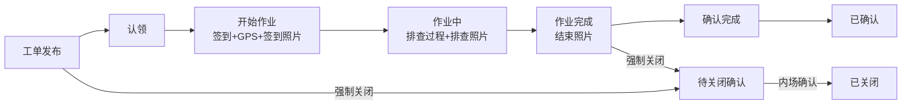
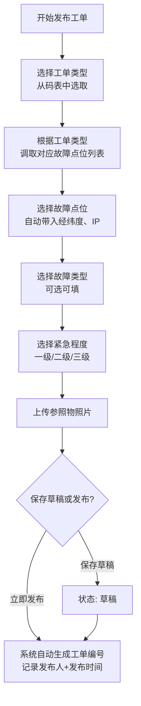
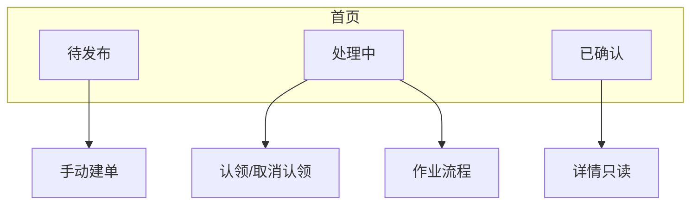
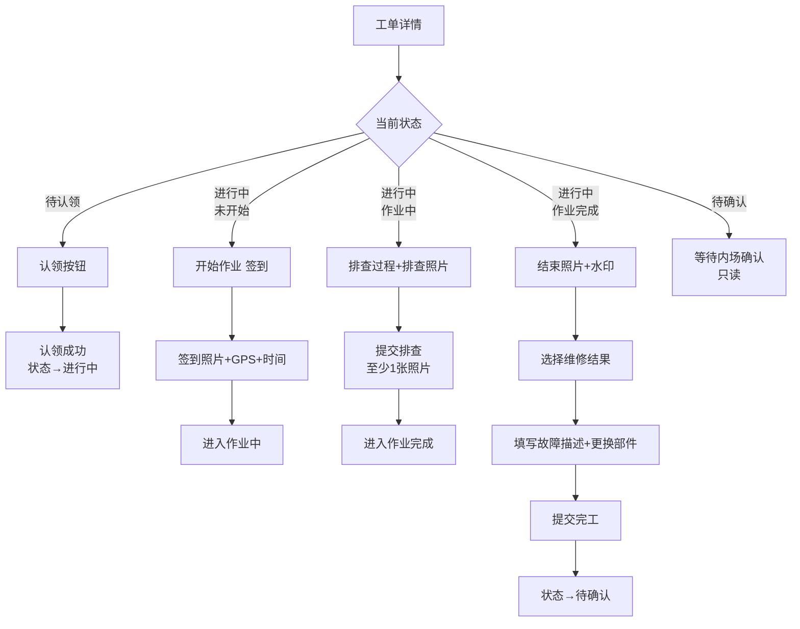
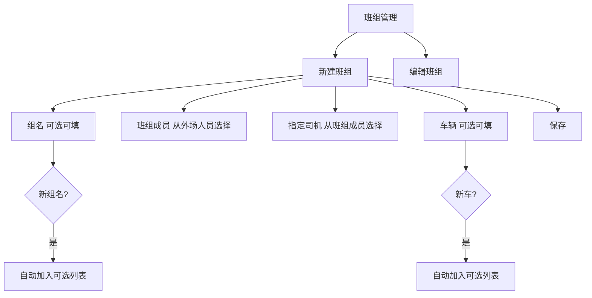
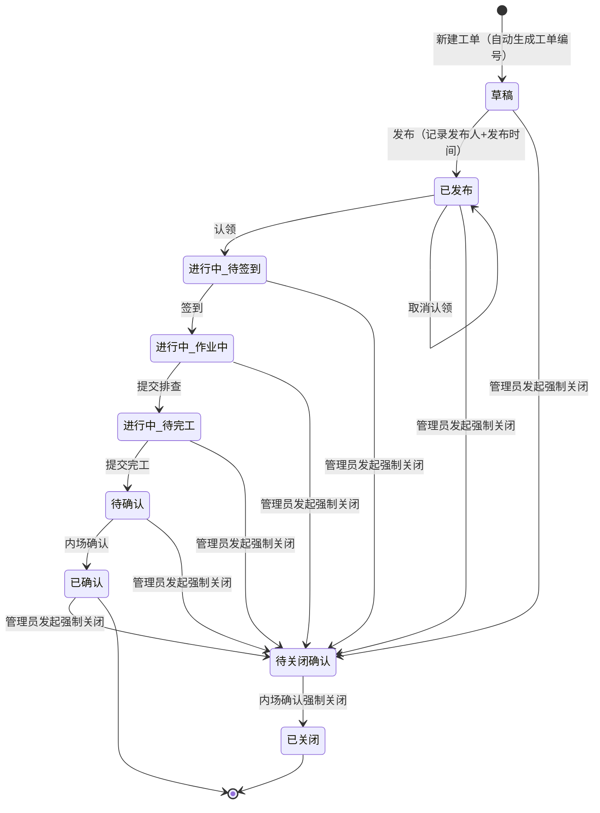

# 工单管理系统（GZGD）— 需求分析文档

> 文档版本：v1.0
> 创建日期：2026-05-28
> 状态：初稿

---

## 1. 项目概述

### 1.1 项目背景

建设一套面向安防监控设备运维的工单管理系统，实现工单从发布、认领、作业到确认的全流程数字化管理，支持内场管理人员与外场工程师的协同作业。

### 1.2 业务目标

- 工单全生命周期数字化管理
- SLA 服务时限监控预警
- 多项目组数据隔离
- 现场作业标准化（签到拍照 → 排查拍照 → 完工拍照确认）
- 班组排班灵活配置

### 1.3 核心流程

### 1.4 角色定义

| 角色 | 说明 | 使用端 | 核心权限 |
|------|------|--------|----------|
| 内场人员 | 后台管理人员，发布工单、确认完工、确认强制关闭 | 管理后台 | 建单、确认、设备管理、确认强制关闭 |
| 外场工程师 | 现场作业人员 | 小程序 | 认领、作业、班组管理 |
| 项目管理人员 | 项目级管理 | 管理后台 | 人员管理、班组查看、SLA配置 |
| 公司管理人员 | 全局管理 | 管理后台 | 全部权限、发起强制关闭 |

---

## 2. 功能需求 — 管理后台

### 2.1 工单管理

#### 2.1.1 工单发布

**功能要素：**

| 字段 | 来源 | 说明 |
|------|------|------|
| 工单编号 | 系统自动生成 | 格式: YYYYMMDD/工单类型-0001（自增序号） |
| 工单类型 | 从运营类型调取 | 选中后过滤设备列表，仅展示该类型设备 |
| 故障点位 | 设备台账下拉选择（按工单类型过滤） | 自动带入经纬度、IP |
| 故障类型 | 可选可填 | 新值自动入库成为可选 |
| 紧急程度 | 码表选择 | 预设: 一级/二级/三级 |
| 参照物照片 | 上传 | 图片 |
| 发布人 | 系统自动获取 | 当前登录用户 |
| 发布时间 | 系统自动 | 发布时记录 |

#### 2.1.2 工单管理列表

| 查询维度 | 类型 | 说明 |
|----------|------|------|
| 故障类型 | 下拉/模糊 | |
| 紧急程度 | 码表筛选 | |
| 工程师 | 人员选择 | 认领人 |
| 状态 | 多选 | 待认领/进行中/待确认/已确认/已关闭 |
| 日期范围 | 日期选择器 | 发布时间 |

**列表展示字段：** 工单编号 | 故障点位 | 紧急程度 | 工单类型 | 故障类型 | 状态 | 发布人 | 发布时间 | 认领人 | SLA状态

#### 2.1.3 工单详情 — 生命周期时间线

| 节点 | 记录内容 | 触发时机 |
|------|----------|----------|
| 发布时间 | 时间 + 发布人 | 点击"发布" |
| 认领时间 | 时间 + 认领人 | 点击"认领" |
| 开始作业时间 | 时间 + GPS 坐标 | 现场签到 |
| 作业中时间 | 时间 | 点击"作业中" |
| 完成时间 | 时间 + 维修结果 | 提交完工 |
| 确认时间 | 时间 + 确认人 | 内场确认 |
| 强制关闭发起时间 | 时间 + 发起人 + 原因 | 管理员发起强制关闭 |
| 强制关闭确认时间 | 时间 + 确认人 | 内场人员确认强制关闭 |
| 工单编号 | 系统自动生成 | 发布时间触发，格式: YYYYMMDD/工单类型-0001 |

**时长计算：**
- 响应时长 = 认领时间 − 发布时间
- 修复时长 = 确认时间 − 认领时间

#### 2.1.4 强制关闭

强制关闭为两步操作：管理员发起 → 内场人员确认后生效。

| 步骤 | 操作 | 权限 | 结果 |
|------|------|------|------|
| 1 | 发起强制关闭 | 公司管理人员、项目管理人员 | 工单进入"待关闭确认"状态，记录原因、发起人、发起时间 |
| 2 | 确认强制关闭 | 内场人员 | 工单进入"已关闭"状态，记录确认人、确认时间 |

---

### 2.2 基础数据管理

#### 2.2.1 设备台账

| 字段 | 类型 | 必填 | 说明 |
|------|------|------|------|
| 编号 | 文本 | 是 | 唯一 |
| 名称 | 文本 | 是 | |
| 区域 | 文本 | 否 | |
| Mac | 文本 | 否 | |
| IP | 文本 | 否 | |
| 经度 | 小数 | 否 | |
| 纬度 | 小数 | 否 | |
| 摄像机类型 | 文本 | 否 | |
| 运营类型 | 文本 | 否 | 自动映射为工单类型 |
| 项目组名 | 文本 | 是 | 数据隔离依据 |

**批量操作：** Excel 导入 / 导出，支持模板下载。

#### 2.2.2 人员管理

| 字段 | 必填 | 说明 |
|------|------|------|
| 账号 | 是 | 登录用，唯一 |
| 姓名 | 是 | |
| 手机号 | 是 | |
| 角色 | 是 | 内场/外场/项目管理/公司管理 |
| 项目组名 | 是 | 数据隔离依据 |

#### 2.2.3 码表管理

| 码表类型 | 维护项 | 说明 |
|----------|--------|------|
| 紧急程度 | 级别名称 + 排序 | 默认: 一级/二级/三级 |
| 项目组名 | 组名 | 数据隔离分组 |

---

### 2.3 SLA 配置

为不同紧急程度设置目标时限，页面默认填入以下数值，管理员可自行修改。

| 紧急程度 | 目标响应时限 | 目标修复时限 |
|----------|-------------|-------------|
| 一级 | 60 min | 240 min |
| 二级 | 30 min | 120 min |
| 三级 | 15 min | 60 min |

> 以上为默认值，页面实现时默认填入并可编辑修改。
> 超时工单在列表行标红 + 图标预警。

---

### 2.4 班组查看

管理人员按时间段查看班组排班情况，展示维度：班组名称、班组成员、司机、车辆、时间段。

---

## 3. 功能需求 — 移动端小程序

### 3.1 首页导航

#### 3.1.1 待发布

功能与后台建单一致，面向外场工程师在移动端建单。

#### 3.1.2 处理中

| 子状态 | 说明 | 可操作 |
|--------|------|--------|
| 待认领 | 已发布未认领 | 认领、置顶 |
| 进行中 | 已接单未完成 | 进入作业流程 |
| 待确认 | 已完工未确认 | 等待内场确认 |

**排序规则：** 置顶（最前）→ 一级（第二）→ 二级（第三）→ 三级（第四）→ 按发布时间倒序

#### 3.1.3 已确认

展示已确认完成的工单列表，只读。支持按工单编号排序（选择按年月日排序或按工单类型排序，均按发布时间排列）。

---

### 3.2 工单详情 — 作业流程

#### 3.2.1 开始作业（签到+签到照片）

- 到达现场后点击"签到"
- 系统自动记录当前时间
- 系统自动获取 GPS 位置（经度 + 纬度）
- **必须拍摄现场签到照片**，未上传照片不可签到
- 未签到前不可进行后续操作

#### 3.2.2 作业中（排查+排查照片）

- 填写排查过程文字描述
- **必须拍摄现场排查照片**，提交排查时至少上传 1 张

#### 3.2.3 作业完成（结束照片+水印）

- **结束照片上传（必须）**，后端 Java 叠加水印：地点 + 时间
- 选择维修结果：已修复 / 未修复
- 填写故障现象描述及本次服务的特殊要求
- 填写更换部件（如有）
- 维修人：显示认领人的班组人员信息
- 点击"提交完工"，工单进入"待确认"状态

---

### 3.3 班组管理

| 字段 | 来源 | 说明 |
|------|------|------|
| 组名 | 下拉选择 / 手动输入 | 新值自动入库 |
| 班组成员 | 多选（外场人员） | 从 personnel 筛选 |
| 司机 | 单选（班组成员中） | 必须是班组成员 |
| 车辆 | 下拉选择 / 手动输入 | 新值自动入库 |
| 时间段 | 开始日期 ~ 结束日期 | 按时间段排班 |

---

## 4. 数据隔离规则

| 维度 | 规则 |
|------|------|
| 项目组 | 不同项目组的工单、设备、人员互不可见 |
| 工单范围 | 外场仅见本组工单，内场管理员可见本组 |
| 设备选择 | 建单时仅可选本组的设备台账 |
| 人员管理 | 管理员仅管理本组成员 |

---

## 5. 非功能性需求

| 维度 | 要求 |
|------|------|
| 响应速度 | 列表查询 < 2s，操作响应 < 1s |
| 并发 | 支持 50 人同时在线操作 |
| 安全性 | 微信一键登录（获取微信用户信息授权），接口鉴权 |
| 兼容性 | 小程序兼容 iOS/Android 微信客户端 |

---

## 6. 附录：状态流转总图

