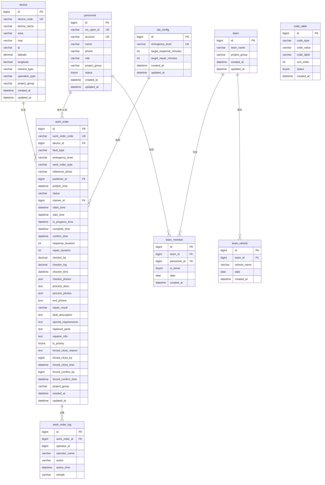

# 工单管理系统（GZGD）— 数据库设计文档

> 文档版本：v1.0
> 创建日期：2026-05-28
> 数据库：MySQL 8.0

---

## 1. ER 图（整体关系）



---

## 2. 表结构详细设计

### 2.1 `device` — 设备台账

**说明：** 存储监控设备基础信息，供工单发布时选择点位。

| 字段名 | 类型 | 长度 | 约束 | 说明 |
|--------|------|------|------|------|
| id | BIGINT | | PK, AUTO_INCREMENT | 主键 |
| device_code | VARCHAR | 50 | UNIQUE, NOT NULL | 设备编号 |
| device_name | VARCHAR | 100 | NOT NULL | 设备名称 |
| area | VARCHAR | 100 | | 所属区域 |
| mac | VARCHAR | 50 | | MAC 地址 |
| ip | VARCHAR | 50 | | IP 地址 |
| latitude | DECIMAL | 10,7 | | 纬度 |
| longitude | DECIMAL | 10,7 | | 经度 |
| camera_type | VARCHAR | 50 | | 摄像机类型 |
| operation_type | VARCHAR | 50 | | 运营类型 → 工单类型 |
| project_group | VARCHAR | 50 | NOT NULL | 项目组名（数据隔离） |
| created_at | DATETIME | | DEFAULT CURRENT_TIMESTAMP | 创建时间 |
| updated_at | DATETIME | | ON UPDATE CURRENT_TIMESTAMP | 更新时间 |

**索引：**

```sql
CREATE INDEX idx_device_project_group ON device(project_group);
CREATE INDEX idx_device_device_code ON device(device_code);
CREATE INDEX idx_device_ip ON device(ip);
```

---

### 2.2 `personnel` — 人员管理

**说明：** 存储系统所有用户信息，通过微信 OpenID 关联小程序登录，后台使用账号登录。

| 字段名 | 类型 | 长度 | 约束 | 说明 |
|--------|------|------|------|------|
| id | BIGINT | | PK, AUTO_INCREMENT | 主键 |
| wx_open_id | VARCHAR | 100 | UNIQUE | 微信 OpenID |
| account | VARCHAR | 50 | UNIQUE, NOT NULL | 登录账号（后台管理用） |
| name | VARCHAR | 50 | NOT NULL | 姓名 |
| phone | VARCHAR | 20 | NOT NULL | 手机号 |
| role | VARCHAR | 20 | NOT NULL | 角色: 内场/外场/项目管理/公司管理 |
| project_group | VARCHAR | 50 | NOT NULL | 项目组名 |
| status | TINYINT | 1 | DEFAULT 1 | 状态: 1=启用, 0=禁用 |
| created_at | DATETIME | | DEFAULT CURRENT_TIMESTAMP | |
| updated_at | DATETIME | | ON UPDATE CURRENT_TIMESTAMP | |

**索引：**

```sql
CREATE INDEX idx_personnel_project_group ON personnel(project_group);
CREATE INDEX idx_personnel_role ON personnel(role);
CREATE UNIQUE INDEX idx_personnel_account ON personnel(account);
CREATE UNIQUE INDEX idx_personnel_wx_open_id ON personnel(wx_open_id);
```

---

### 2.3 `code_table` — 码表

**说明：** 存储动态配置的码表数据，如紧急程度、项目组名、工单类型等。

| 字段名 | 类型 | 长度 | 约束 | 说明 |
|--------|------|------|------|------|
| id | BIGINT | | PK, AUTO_INCREMENT | 主键 |
| code_type | VARCHAR | 50 | NOT NULL | 码表类型: emergency_level / project_group / fault_type |
| code_value | VARCHAR | 50 | NOT NULL | 码值 |
| code_label | VARCHAR | 100 | NOT NULL | 显示名称 |
| sort_order | INT | | DEFAULT 0 | 排序号 |
| status | TINYINT | 1 | DEFAULT 1 | 1=启用, 0=禁用 |
| created_at | DATETIME | | DEFAULT CURRENT_TIMESTAMP | |

**索引：**

```sql
CREATE INDEX idx_code_type ON code_table(code_type);
CREATE UNIQUE INDEX idx_code_type_value ON code_table(code_type, code_value);
```

---

### 2.4 `work_order` — 工单（核心表）

**说明：** 工单全生命周期数据，包含从发布到确认的所有字段和时间节点。

| 字段名 | 类型 | 长度 | 约束 | 说明 |
|--------|------|------|------|------|
| id | BIGINT | | PK, AUTO_INCREMENT | 主键 |
| work_order_code | VARCHAR | 50 | UNIQUE, NOT NULL | 工单编号: YYYYMMDD/工单类型-0001 |
| device_id | BIGINT | | FK → device.id | 关联设备 |
| fault_type | VARCHAR | 100 | | 故障类型 |
| emergency_level | VARCHAR | 20 | NOT NULL | 紧急程度（码表）: 一级/二级/三级 |
| work_order_type | VARCHAR | 50 | | 工单类型（来自码表） |
| reference_photo | VARCHAR | 500 | | 参照物照片 URL |
| publisher_id | BIGINT | | FK → personnel.id | 发布人 |
| publish_time | DATETIME | | | 发布时间 |
| status | VARCHAR | 20 | NOT NULL | 状态: draft/published/claimed/in_progress/completing/confirmed/pending_force_close/closed |
| claimer_id | BIGINT | | FK → personnel.id | 认领人 |
| claim_time | DATETIME | | | 认领时间 |
| start_time | DATETIME | | | 开始作业时间 |
| in_progress_time | DATETIME | | | 作业中时间 |
| complete_time | DATETIME | | | 完成时间 |
| confirm_time | DATETIME | | | 确认时间 |
| response_duration | INT | | | 响应时长（分钟） |
| repair_duration | INT | | | 修复时长（分钟） |
| checkin_lat | DECIMAL | 10,7 | | 签到纬度 |
| checkin_lng | DECIMAL | 10,7 | | 签到经度 |
| checkin_time | DATETIME | | | 签到时间 |
| checkin_photos | JSON | | | 签到照片 URL 数组 |
| process_desc | TEXT | | | 排查过程文字 |
| process_photos | JSON | | | 排查照片 URL 数组 |
| end_photos | JSON | | | 结束照片 URL 数组（含水印） |
| repair_result | VARCHAR | 20 | | 维修结果: fixed/not_fixed |
| fault_description | TEXT | | | 故障现象描述 |
| special_requirements | TEXT | | | 特殊要求 |
| replaced_parts | TEXT | | | 更换部件 |
| repairer_info | TEXT | | | 维修人信息（JSON 班组信息） |
| is_priority | TINYINT | 1 | DEFAULT 0 | 是否置顶 |
| forced_close_reason | TEXT | | | 强制关闭原因 |
| forced_close_by | BIGINT | | FK → personnel.id | 强制关闭发起人 |
| forced_close_time | DATETIME | | | 强制关闭发起时间 |
| forced_confirm_by | BIGINT | | FK → personnel.id | 强制关闭确认人 |
| forced_confirm_time | DATETIME | | | 强制关闭确认时间 |
| project_group | VARCHAR | 50 | NOT NULL | 项目组（数据隔离） |
| created_at | DATETIME | | DEFAULT CURRENT_TIMESTAMP | |
| updated_at | DATETIME | | ON UPDATE CURRENT_TIMESTAMP | |

**索引：**

```sql
CREATE INDEX idx_wo_status ON work_order(status);
CREATE INDEX idx_wo_project_group ON work_order(project_group);
CREATE UNIQUE INDEX idx_work_order_code ON work_order(work_order_code);
CREATE INDEX idx_wo_emergency ON work_order(emergency_level);
CREATE INDEX idx_wo_publisher ON work_order(publisher_id);
CREATE INDEX idx_wo_claimer ON work_order(claimer_id);
CREATE INDEX idx_wo_publish_time ON work_order(publish_time);
CREATE INDEX idx_wo_device ON work_order(device_id);
-- 复合索引用于列表查询排序
CREATE INDEX idx_wo_list ON work_order(project_group, status, emergency_level, is_priority, publish_time);
```

---

### 2.5 `work_order_log` — 工单操作日志

**说明：** 记录工单每个状态变更的操作轨迹。

| 字段名 | 类型 | 长度 | 约束 | 说明 |
|--------|------|------|------|------|
| id | BIGINT | | PK, AUTO_INCREMENT | 主键 |
| work_order_id | BIGINT | | FK → work_order.id | 工单 ID |
| operator_id | BIGINT | | | 操作人 ID |
| operator_name | VARCHAR | 50 | | 操作人姓名 |
| action | VARCHAR | 50 | NOT NULL | 操作类型: publish/claim/cancel_claim/start/in_progress/complete/confirm/force_close/confirm_force_close |
| action_time | DATETIME | | NOT NULL | 操作时间 |
| remark | VARCHAR | 500 | | 备注说明 |

**索引：**

```sql
CREATE INDEX idx_wol_work_order ON work_order_log(work_order_id);
CREATE INDEX idx_wol_action_time ON work_order_log(action_time);
```

---

### 2.6 `sla_config` — SLA 配置

**说明：** 各紧急程度对应的目标响应时限和修复时限。

| 字段名 | 类型 | 长度 | 约束 | 说明 |
|--------|------|------|------|------|
| id | BIGINT | | PK, AUTO_INCREMENT | 主键 |
| emergency_level | VARCHAR | 20 | UNIQUE, NOT NULL | 紧急程度 |
| target_response_minutes | INT | | NOT NULL | 目标响应时限（分钟） |
| target_repair_minutes | INT | | NOT NULL | 目标修复时限（分钟） |
| created_at | DATETIME | | DEFAULT CURRENT_TIMESTAMP | |
| updated_at | DATETIME | | ON UPDATE CURRENT_TIMESTAMP | |

**初始数据：**

```sql
INSERT INTO sla_config (emergency_level, target_response_minutes, target_repair_minutes) VALUES
('一级', 60, 240),
('二级', 30, 120),
('三级', 15, 60);
```

---

### 2.7 `team` — 班组

**说明：** 班组基本信息。

| 字段名 | 类型 | 长度 | 约束 | 说明 |
|--------|------|------|------|------|
| id | BIGINT | | PK, AUTO_INCREMENT | 主键 |
| team_name | VARCHAR | 100 | NOT NULL | 班组名称 |
| project_group | VARCHAR | 50 | NOT NULL | 所属项目组 |
| created_at | DATETIME | | DEFAULT CURRENT_TIMESTAMP | |
| updated_at | DATETIME | | ON UPDATE CURRENT_TIMESTAMP | |

**索引：**

```sql
CREATE INDEX idx_team_project_group ON team(project_group);
```

---

### 2.8 `team_member` — 班组成员

**说明：** 班组与人员的关联关系，按时间段（date 起）配置。

| 字段名 | 类型 | 长度 | 约束 | 说明 |
|--------|------|------|------|------|
| id | BIGINT | | PK, AUTO_INCREMENT | 主键 |
| team_id | BIGINT | | FK → team.id | 班组 ID |
| personnel_id | BIGINT | | FK → personnel.id | 人员 ID |
| is_driver | TINYINT | 1 | DEFAULT 0 | 是否司机 |
| date | DATE | | NOT NULL | 排班起始日期 |
| created_at | DATETIME | | DEFAULT CURRENT_TIMESTAMP | |

**索引：**

```sql
CREATE INDEX idx_tm_team ON team_member(team_id);
CREATE INDEX idx_tm_date ON team_member(date);
```

---

### 2.9 `team_vehicle` — 班组车辆

**说明：** 班组配置的车辆信息，按时间段配置。

| 字段名 | 类型 | 长度 | 约束 | 说明 |
|--------|------|------|------|------|
| id | BIGINT | | PK, AUTO_INCREMENT | 主键 |
| team_id | BIGINT | | FK → team.id | 班组 ID |
| vehicle_name | VARCHAR | 100 | NOT NULL | 车辆名称 |
| date | DATE | | NOT NULL | 排班起始日期 |
| created_at | DATETIME | | DEFAULT CURRENT_TIMESTAMP | |

**索引：**

```sql
CREATE INDEX idx_tv_team ON team_vehicle(team_id);
```

---

## 3. 建库建表 SQL 脚本

### 3.1 建库

```sql
CREATE DATABASE IF NOT EXISTS gzgd DEFAULT CHARACTER SET utf8mb4 COLLATE utf8mb4_unicode_ci;
USE gzgd;
```

### 3.2 建表及初始化

> 完整的建表 SQL 保存于 `C:\gzdb\docs\sql\init.sql`

---

## 4. 状态枚举定义

| 状态值 | 说明 | 前端显示 |
|--------|------|----------|
| draft | 草稿 | 待发布 |
| published | 已发布 | 待认领 |
| claimed | 已认领 | 进行中-待签到 |
| in_progress | 作业中 | 进行中-作业中 |
| completing | 待完工提交 | 进行中-待完工 |
| confirmed | 已确认 | 已确认 |
| pending_force_close | 待关闭确认 | 待关闭确认 |
| closed | 已关闭 | 已关闭 |

## 5. 角色枚举定义

| 角色值 | 说明 |
|--------|------|
| 内场 | 内场人员 |
| 外场 | 外场工程师 |
| 项目管理 | 项目管理人员 |
| 公司管理 | 公司管理人员 |

## 6. 数据隔离策略

所有包含 `project_group` 字段的表在查询时均需追加该过滤条件：

```sql
-- MyBatis-Plus 拦截器自动追加
AND t.project_group = #{currentUser.projectGroup}
```

使用 MyBatis-Plus 的 `Interceptor` 或 `TenantLineInnerInterceptor` 实现行级数据隔离，无需在每个 Mapper 中手动拼接。
